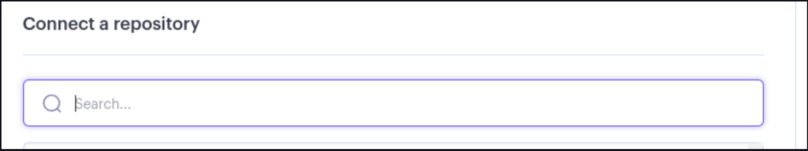

# Hangman Game

*The link to [Hangman Game](https://hangman-game-k5vx.onrender.com/)

"Hangman Adventure" is an exhilarating terminal-based Python project designed to engage users and deliver diverse experiences.

In addition, it can serve as a fun way for users to enhance their vocabulary and logical thinking skills.

Users will swiftly grasp the game mechanics and input various choices based on the given prompts. Ultimately, they will receive an immersive gaming experience as they strive to guess the secret word. The words they provide will be seamlessly integrated into the gameplay, adapting to the context of the Hangman story.

As they play, users not only enjoy the suspense and challenge but also have the opportunity to reinforce their understanding of language and word patterns. This engaging journey encourages both entertainment and educational value, making Hangman Adventure a unique and enjoyable experience for players of all ages.

---

## How to play:

  1. Click this *[link](https://hangman-game-k5vx.onrender.com/)* or copy this text: `https://hangman-game-k5vx.onrender.com/` and paste it in your browser's address bar.
  2. Once the page is loaded, click 'RUN PROGRAM.'
  3. Choose from the options.
  4. If you choose 1 ,learn the rules.If you choose 2,start the game.
  5. Now choose the difficulty level.
  6. As soon as you select the level, the game will begin.
  7. Guess the letter or word.
  8. When the game ends, you can either exit the game or continue playing by selecting a level.

---
## User Stories
### First Time Visitpr Goals:

* As a First Time Visitor, I want to quickly understand the program's primary purpose so that I can learn more about this program.
* As a First Time Visitor, I want to navigate through the program easily so that I can find the content.
* As a First Time Visitor, I want to find the program useful for myself so that I can fulfill my expectations.
* As a First Time Visitor, I want to see different text colors so I can easily read the story.

### Frequent Visitor Goals:

* Being a Regular Player, I intend to utilize various words for my guesses in order to relish a variety of gameplay scenarios.
* As a Repeated Visitor, I anticipate the game's narratives to consistently maintain readability, allowing me to engage in the gaming experience seamlessly without facing any comprehension challenges.

---

## Features

  - **When the program is loaded**

  The user can see a welcoming message which engages to start playing and choose from options:

   1.Rules

   2.Start game

  

  - **When the user select an option**

  - If the user select number 1, shows in terminal the game rules.

  
  
  - If the user select number 2, shows in terminal the level difficulties.

  

  In the context of the Hangman game, the different difficulty levels typically refer to the complexity or challenge presented to the player. Here's how the difficulty levels might be categorized:

    1. Easy: In this level, the secret word might be relatively short, and the player would have a higher number of attempts to guess the letters or the word. This level is suitable for beginners or those looking for a more relaxed gameplay experience.

    2. Medium: The secret word's length and complexity increase compared to the easy level. The player may have a moderate number of attempts to guess the word correctly. This level provides a balanced challenge for players with some familiarity with the game.

    3. Hard: This level offers a substantial challenge. The secret word can be quite long or include less common letters. The player may have a limited number of attempts to guess the word, making each choice critical. This level is ideal for experienced players seeking a tough challenge.

These difficulty levels add variety and cater to players with different skill levels, ensuring that both newcomers and seasoned players can enjoy the Hangman game according to their preferences and abilities.

  - **When the user select a level**

  - Depending on which level is chosen, the rules of the game are the same.

  - The game starting when the user select a level.


  - **Setup:**

  - A secret word is chosen by the secret-keeper.(In this case by computer). This  word is usually not revealed to the player.
  - The player is provided with the number of letters in the secret word, represented by underscores (_).
  - The player is also given a limited number of attempts (represented by the image of a hangman).

 

  - **Guessing:**
  
  - The player starts guessing letters one by one. Each guess can be a single letter or an entire word.
  - After each guess, the game provides feedback:
  - If the guessed letter is in the secret word, it is revealed in the correct positions.
  - If the guessed letter is not in the word, a part of the hangman figure is drawn (head, body, arms, legs, etc.).
  - If the player guesses all the letters of the word correctly, they win the game.

  
  

 - **Winning and Losing:**
        
 - The player wins if they correctly guess the entire word before the hangman figure is fully drawn.
 - The player loses if they use up all their attempts (the entire hangman figure is drawn) before correctly guessing the word.
 - When the game is end ,the terminal shows again the level difficulty and Quit option.

 
 

 ---

## Flowchart

 The flowchart represents the logic of the application:

  


---
## Technologies Used

### Languages:

 - [Python 3.11.4](https://www.python.org/downloads/): used to anchor the project and direct all application behavior
 - [JavaScript](https://www.javascript.com/): used to provide the start script needed to run the Code Institute mock terminal in the browser
 - [HTML](https://developer.mozilla.org/en-US/docs/Web/HTML) used to construct the elements involved in building the mock terminal in the browser

### Frameworks/Libraries, Programmes and Tools:
#### Python modules/packages:

#### Standard Library imports:

- [random](https://docs.python.org/3/library/random.html) was used to implement pseudo-random number generation.
- [os](https://docs.python.org/3/library/os.html ) was used to clear the terminal before running the program.

##### Third-party imports:

- [Colorama](https://pypi.org/project/colorama/) was used to add colors and styles to the project.

#### Other tools:

- [VSCode](https://code.visualstudio.com/) was used as the main tool to write and edit code.
- [Git](https://git-scm.com/) was used for the version control of the website.
- [GitHub](https://github.com/) was used to host the code of the website.
- [Miro.com](https://miro.com/app/dashboard/) was used to make a flowchart for the README file.


---

## Bugs 

+ **Solved bugs**

1. While coding, I encountered a bug where, upon pressing any key other than those expected, the terminal responded with the message "command not found".


 - *Solution:* in some functions was added a while loop and continue statement

  ```python
   while True:
        choice = input(f"{colorama.Fore.YELLOW}Enter your choice (1 or 2): \n")
        if choice == "1":
            show_rules()
            print(f"{colorama.Fore.GREEN}1.{colorama.Style.RESET_ALL}Go back 🔙")
            answer = input(
                f"{colorama.Fore.YELLOW}Enter number 1 to go back: \n")
            if answer == "1":
                clear_screen()
                welcome_message()

        elif choice == "2":
            main()
        else:
            print(f"{colorama.Fore.RED}Invalid choice. Please enter 1 or 2.")
            continue
  ```
 
 

 

2. When the user want to go back from the rules and type any other key then expected, displaying to choose from number 1 or 2.


 - *Solution:* I made function ```wait_for_any_key``` and called in ```welcome_message``` at the right place.

 ```python
 def welcome_message():
     """
     Displays the welcome message and menu options to
     the player.
     """
     print(f"{colorama.Back.MAGENTA}Welcome to Hangman Game!😀")
     print(f"{colorama.Fore.GREEN}Options:{colorama.Style.RESET_ALL}")
     print(f"{colorama.Fore.GREEN}1.{colorama.Style.RESET_ALL} Rules")
     print(f"{colorama.Fore.GREEN}2.{colorama.Style.RESET_ALL} Start Game")

     while True:
         choice = input(f"{colorama.Fore.YELLOW}Enter your choice (1 or 2): \n")
         clear_screen()
         if choice == "1":
             show_rules()
             wait_for_any_key()
         elif choice == "2":
             main()
         else:
             print(f"{colorama.Fore.RED}Invalid choice. Please enter 1 or 2.")
             continue


 def wait_for_any_key():
     print(f"{colorama.Fore.YELLOW}Press any key to go back...")
     input()  # Wait for any key press
     clear_screen()
     welcome_message()
     ```

  


3. Function  ```clear_screen``` was not called at the right place ,so it was not working.

 - *Solution:* I called the function inside the right functions.


 + **Unsolved bugs**
   
  - None.

  
---
## Testing

Please refer to the [TESTING.md](TESTING.md) file for all test related documentation.

---
## Deployment

- The program was deployed to [Render](https://render.com/)
- The program can be reached by the [link](https://hangman-game-k5vx.onrender.com)
### To deploy the project as an application that can be **run locally**:

*Note:*
  1. This project requires you to have Python installed on your local PC:
  - `sudo apt install python3`

  1. You will also need pip installed to allow the installation of modules the application uses.
  - `sudo apt install python3-pip`

Create a local copy of the GitHub repository by following one of the two processes below:

- Download ZIP file:
  1. Go to the [GitHub Repo page](https://github.com/NikolettaGr/hangman_with_python/tree/main).
  1. Click the Code button and download the ZIP file containing the project.
  1. Extract the ZIP file to a location on your PC.

- Clone the repository:
  1. Open a folder on your computer with the terminal.
  1. Run the following command
  - `git clone https://github.com/NikolettaGr/hangman_with_python.git`

1. Install Python module dependencies:
     
      1. Navigate to the folder madlib_with_python by executing the command:
      - `cd madlib_with_python`
      1. Run the command pip install -r requirements.txt
      - `pip3 install -r requirements.txt`

### To deploy the project to Render so it can be run as a remote web application:

1. Create a new Render account if you don't already have one here [Render](https://render.com/).

2. Create a new application on the following page here [New Render App](https://dashboard.render.com/), choose **Webserver**:
    
    - 

3. Select the GitHub option and connect the application to the repository you created.
    
    - 

4. Search for the repository you created and click "Connect."
    
    - 

    - 

5. Create name for the application

    - 

6. Select the region where you want to deploy the application.

    - 

7. Select branch to deploy.

    - 

8. Select environment.

    - 

9. Render build command: `pip3 install -r requirements.txt && npm install`

    - 

10. Render start command: `node index.js`

    - 

11. Select Free plan.

    - 

12. Click on "Advanced" settings.

    - 

13. Add the following environment variables:

    - Key: PORT Value: 8000
    - Key: PYTHON_VERSION Value: 3.10.7

    - 

14. Click "Create Web Service."

    - 

15. Wait for the completion of the deployment.


---
## Credits

 - Color formatting: [Colorama](https://pypi.org/project/colorama/).
 - KiteHQ YouTube channel helped many and I followed many steps to understand the whole game: [KiteHQ](https://www.youtube.com/watch?v=m4nEnsavl6w)


---
## Aknowledgements

 [Iuliia Konovalova](https://github.com/IuliiaKonovalova)

 I am enormously thankful to my mentor Iuliia Konovalova for her guidance and valuable feedback!


